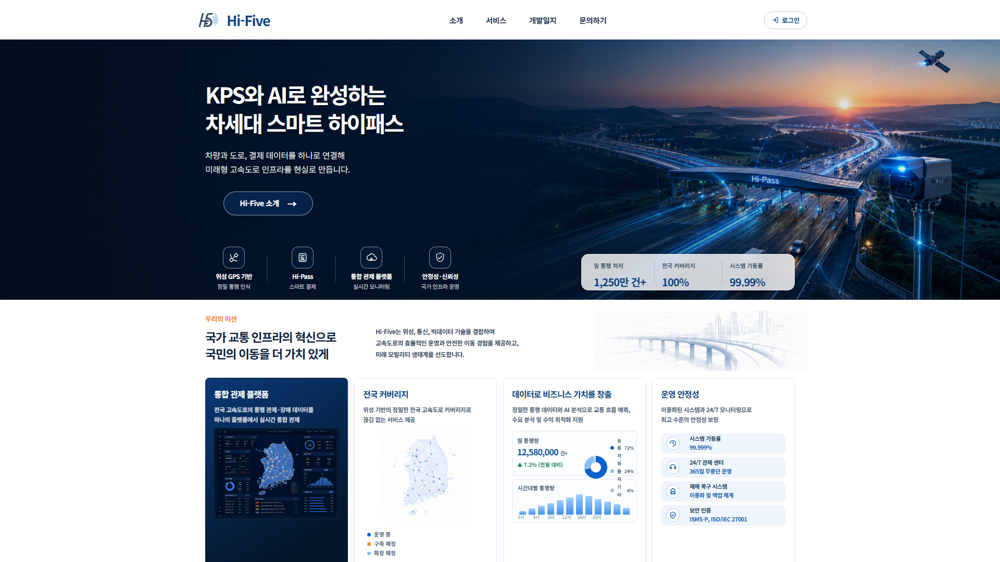
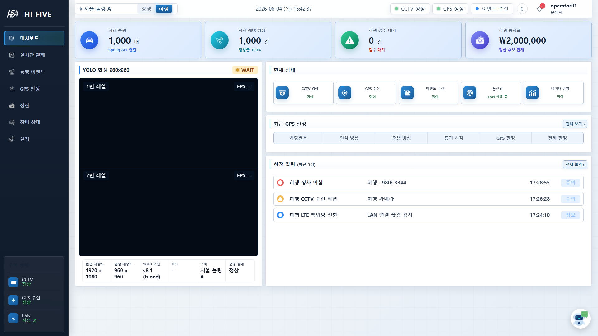
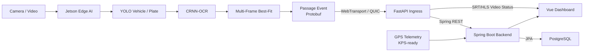
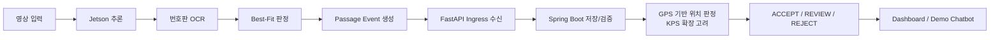

# HI-FIVE Smart Tolling

AI 기반 차량 번호판 인식과 GPS 기반 통행 판정을 결합하고, 향후 KPS 정밀 위치 연계를 고려한 미래형 스마트 톨링 프로젝트입니다.

기존 하이패스 구조를 대체하기보다, 현장 Edge AI가 통행 이벤트를 생성하고 중앙 서버가 저장, 검증, 운영 조회를 담당하는 확장형 PoC 구조를 목표로 합니다.

## 프로젝트 개요

- 프로젝트명: AI 기반 미래형 스마트 톨링 시스템
- 개발 기간: 2026.04.27 ~ 2026.06.01
- 개발 인원: 5명
- 개발 방식: Jetson Edge AI, Python Ingress, Spring Boot Backend, Vue Frontend 분리 구조
- 저장소: [teamweb803/straffic_hi-five-1st-project](https://github.com/teamweb803/straffic_hi-five-1st-project)

## 팀 구성

| 이름 | 주요 참여 파트 |
| --- | --- |
| 김민진(팀장) | 프로젝트 총괄, Python/Edge, YOLO, Backend |
| 고문식 | Frontend, DB |
| 안민수 | Python/Edge, YOLO, Backend |
| 박주환 | Frontend, DB, Edge 지원 |
| 최정민 | Backend, Python/Edge, YOLO |

## 핵심 기능

- Jetson Orin Nano 기반 차량 및 번호판 인식
- YOLO 기반 차량/번호판 탐지
- CRNN-OCR 기반 번호판 문자 인식
- 다중 프레임 OCR 후보 누적 및 Best-Fit 판정
- Passage Event 생성 및 Protobuf 바이너리 payload 구성
- WebTransport over QUIC/TLS 기반 Edge 이벤트 전송
- FastAPI Ingress 기반 이벤트 수신, ACK/RETRY/REJECT 처리
- Spring Boot 기반 통행 이벤트 수신/저장, GPS telemetry 저장, 검수/정산 후보 관리, 톨존 기반 통행 판정
- PostgreSQL 기반 통행 이벤트 payload/인식 결과 요약, GPS telemetry, 검수/정산 후보, Edge/Ingress 상태, 톨존, 통행 이력 저장
- Vue Dashboard 기반 실시간 관제, 운영자/관리자 화면, 상태 조회
- SRT/HLS 기반 관제 영상 표시 구조
- Failover 설정 기반 유선망 장애 대응 및 예비망 전환 흐름

## 기술 스택

### Edge AI

- Jetson Orin Nano
- Python
- GStreamer
- DeepStream / nvinfer
- CUDA / NVMM
- TensorRT
- YOLO
- CRNN-OCR

### Ingress

- Python 3.11
- FastAPI
- aioquic
- WebTransport over QUIC/TLS
- Protobuf
- Uvicorn

### Backend

- Java 21
- Spring Boot 3.5
- Spring Data JPA
- Spring Security Crypto
- Lombok
- PostgreSQL Driver

### Frontend

- Vue 3
- JavaScript
- Vite
- Vue Router
- Pinia
- Axios
- HLS.js
- Tailwind CSS

### Database / Infra

- PostgreSQL
- Docker
- Docker Hub
- Git / GitHub

## 실행 화면

### 메인 / 서비스 소개



### 관제 대시보드



## 시스템 아키텍처



## 데이터 흐름



## 프로젝트 구조

```text
straffic_hi-five-1st-project/
├── docs/
│   └── images/
├── backend/
│   ├── src/main/java/com/hifive/iot/
│   │   ├── controller/
│   │   ├── dto/
│   │   ├── entity/
│   │   ├── repository/
│   │   └── service/
│   ├── src/main/resources/application.yml
│   └── build.gradle
├── fastapi-edge/
│   ├── app/
│   │   ├── api/
│   │   ├── core/
│   │   └── services/
│   ├── proto/passage_event.proto
│   ├── webtransport_ingress/
│   ├── requirements.txt
│   └── RUN.md
├── frontend/
│   ├── public/
│   ├── src/
│   │   ├── api/
│   │   ├── components/
│   │   ├── dashboards/
│   │   ├── router/
│   │   ├── stores/
│   │   └── views/
│   ├── package.json
│   └── vite.config.js
└── jetson-edge/
    ├── config/
    ├── deepstream_plugins/
    ├── hifive_jetson_py/
    ├── scripts/
    ├── run_edge_service.py
    ├── run_deepstream_nvinfer.py
    └── RUN_JETSON_INGRESS.md
```

## 주요 API

### Backend

- Base URL: `http://localhost:8585`
- Auth: `POST /api/auth/signup`, `POST /api/auth/login`, `POST /api/auth/logout`
- Board: `GET /api/board`, `POST /api/board`
- GPS: `POST /api/gps/telemetry`, `GET /api/gps/telemetry/latest`
- Ingest: `POST /api/ingest/passage-events`
- Toll: `GET /api/toll/zones`, `POST /api/toll/plate-recognitions`, `GET /api/toll/history/latest`
- Admin: `/api/admin/companies`, `/api/admin/members`, `/api/admin/map-markers`

### FastAPI Ingress

- Ops URL: `http://localhost:8000`
- Health: `GET /healthz`
- Status: `GET /status`
- Metrics: `GET /metrics`
- 개발용 전달 테스트: `POST /internal/passage-events`
- 운영 전송 기준: WebTransport over QUIC/TLS

### Jetson Edge Service

- Local service URL: `http://127.0.0.1:8010`
- Status: `GET /status`
- MP4 source start: `POST /source/video`
- Camera source start: `POST /source/camera`
- Source stop: `POST /source/stop`

## 로컬 실행

### 1. Database

PostgreSQL 사용 기준입니다.

```text
DB 이름: hifive
사용자: pgadmin
비밀번호: 1004
로컬 `application.yml` 기본 포트: `5433`
```

Docker Compose를 사용할 경우 backend의 DB URL은 컨테이너 네트워크 기준으로 지정합니다.

```text
HIFIVE_DB_URL=jdbc:postgresql://db:5432/hifive
HIFIVE_DB_USERNAME=pgadmin
HIFIVE_DB_PASSWORD=1004
```

### 2. Backend

```bash
cd backend
./gradlew bootRun
```

기본 백엔드 포트: `8585`

### 3. FastAPI Ingress

```bash
cd fastapi-edge
pip install -r requirements.txt
uvicorn app.main:app --reload --port 8000
```

운영 WebTransport Ingress는 `fastapi-edge/webtransport_ingress/run_webtransport_ingress.py` 기준으로 실행합니다.

### 4. Frontend

```bash
cd frontend
npm ci
npm run dev
```

기본 프론트엔드 포트: `5173`

### 5. Jetson Edge

Jetson 런타임은 DeepStream, TensorRT, CUDA 환경이 준비된 Jetson 장비에서 실행합니다.

```bash
cd ~/hifive/app
source ~/hifive/.venv/bin/activate
PYTHONPATH=. python run_edge_service.py \
  --config example_runtime_config.py \
  --runtime-runner deepstream-nvinfer \
  --ingress-host <INGRESS_HOST> \
  --ingress-port 4433
```

`<INGRESS_HOST>`에는 FastAPI Ingress가 실행 중인 서버 IP 또는 도메인을 넣습니다.

## Docker 이미지

서비스 기준으로는 `frontend`, `backend`, `fastapi-edge`, `jetson-edge`, `db` 5개로 분리합니다.

DockerHub 업로드 대상은 다음과 같습니다.

- Frontend: [shshj323/hifive-frontend](https://hub.docker.com/r/shshj323/hifive-frontend)
- Backend: [shshj323/hifive-backend](https://hub.docker.com/r/shshj323/hifive-backend)
- FastAPI Edge: [shshj323/hifive-fastapi-edge](https://hub.docker.com/r/shshj323/hifive-fastapi-edge)
- Jetson Edge: [shshj323/hifive-jetson-edge](https://hub.docker.com/r/shshj323/hifive-jetson-edge)
- DB: [shshj323/hifive-postgres](https://hub.docker.com/r/shshj323/hifive-postgres)

## 산출물

- 웹 애플리케이션 산출물: [Notion 문서](https://coconut-truck-1db.notion.site/371cdef944a180a8bf3be44fcfcd9701)

## 구현 범위

- Jetson 기반 차량/번호판 탐지
- CRNN-OCR 기반 번호판 인식
- Multi-Frame Best-Fit 기반 최종 번호판 판정
- Passage Event Protobuf payload 생성
- WebTransport 기반 Edge-to-Ingress 전송
- FastAPI Ingress 수신 및 Spring Boot 전달
- Spring Boot 기반 이벤트 수신/저장, GPS telemetry 저장, 검수/정산 후보 관리, 톨존 기반 통행 판정
- PostgreSQL 기반 운영 데이터 저장
- Vue 기반 운영자/관리자 Dashboard
- Demo Chatbot 기반 프로젝트 안내 및 시연 점검 응답
- Failover 설정 기반 장애 대응 및 예비망 전환 흐름

## 고도화 방향

- 실제 고속도로 환경 장기 데이터 검증
- Edge 장비 OTA, 모델 버전 관리, 원격 재시작 체계
- GPS/KPS 정확도 기준 및 geofence 정책 정교화
- 2줄 번호판, 훼손 번호판, 악천후, 역광 조건 대응
- VPN Overlay, 인증서, 장비별 키 관리 기반 통신 보안 강화
- 정산 시스템, 미납, 오과금, 이의제기 프로세스 연동
