# HI-FIVE 종합 파이프라인 요약

## 1. 프로젝트 기준

HI-FIVE는 기존 하이패스 시스템을 대체하는 전체 시스템이 아니라, 차량 통과 인식, 통행 요금 처리, 검수, 운영 통계를 보조하는 Edge AI 기반 고도화 모듈이다.

핵심 기준:

- Jetson Edge에서 번호판 탐지와 OCR을 수행한다.
- YOLO와 OCR은 병렬 구조로 분리한다.
- YOLO는 OCR 지연과 관계없이 실시간 프레임 추론을 계속 수행한다.
- OCR은 YOLO가 넘긴 번호판 crop만 처리한다.
- Edge-to-server payload는 Protobuf binary를 사용한다.
- Edge-to-server 전송은 WebTransport over QUIC/TLS를 사용한다.
- Spring Boot는 WebTransport를 직접 받지 않고 Python Ingress를 통해 REST로 이벤트를 수신한다.
- GPS telemetry는 Spring Boot에서 직접 수신하고 요금 구간 판단에 사용한다.
- Vue는 Spring Boot REST API만 사용한다.

## 2. 전체 파이프라인

```mermaid
flowchart LR
    subgraph EDGE["Jetson Edge"]
        CAM["Front / Rear Camera<br/>or MP4"]
        GST["GStreamer / DeepStream Input"]
        FRAME["1920x1080 Frame"]
        SPLIT["2-Lane Crop<br/>960x480 + 960x480"]
        CANVAS["960x960 YOLO Input<br/>2 lanes in 1 image"]
        YOLO["YOLO TensorRT<br/>1 inference / frame"]
        RESTORE["bbox Restore<br/>YOLO input -> original frame"]
        TRACK["Tracking<br/>local_track_id"]
        CROP["Plate Crop"]
        SHM["SharedMemory<br/>plate crop only"]
        OCRQ["OCR Queue"]
        OCR["OCR TensorRT Worker"]
        VOTE["OCR Voting<br/>pattern / confidence"]
        EVT["PassageEvent<br/>Protobuf"]
        SPOOL["Local Spool<br/>retry until ACK"]
        WT["WebTransport Client"]

        CAM --> GST --> FRAME --> SPLIT --> CANVAS --> YOLO --> RESTORE --> TRACK --> CROP --> SHM --> OCRQ --> OCR --> VOTE --> EVT --> SPOOL --> WT
        YOLO -. "OCR 지연과 무관하게<br/>실시간 추론 지속" .-> YOLO
    end

    subgraph PY["Python Ingress Server"]
        AIO["aioquic<br/>WebTransport Receiver"]
        SPRINGCLIENT["Spring REST Client"]
        STATUS["FastAPI Status API<br/>health / status / metrics"]
        AIO --> SPRINGCLIENT
        AIO --> STATUS
    end

    subgraph SPRING["Spring Boot Backend"]
        INGEST["REST Ingest API<br/>/api/ingest/passage-events"]
        DEC["Protobuf Decode"]
        VAL["DTO Validation<br/>Duplicate Handling"]
        SAVE["passage_event 저장"]
        FUSION["VehiclePass Fusion<br/>front / rear / track"]
        GPSLOGIC["GPS Toll Zone Logic"]
        REVIEW["Review Workflow"]
        TOLL["toll_history / stats"]
        API["Vue REST API"]

        INGEST --> DEC --> VAL --> SAVE --> FUSION
        FUSION --> GPSLOGIC --> TOLL
        FUSION --> REVIEW
        TOLL --> API
        REVIEW --> API
    end

    subgraph GPS["Vehicle GPS / OBU"]
        GPSDEV["GPS Telemetry Sender"]
        GPSAPI["Spring REST<br/>/api/gps/telemetry"]
        GPSDB["gps_telemetry 저장"]
        GPSDEV --> GPSAPI --> GPSDB --> GPSLOGIC
    end

    subgraph VUE["Vue 3 + axios + Pinia + Vue Router"]
        AXIOS["axios API Client"]
        PINIA["Pinia Store"]
        ROUTER["Vue Router"]
        PAGES["Public / Admin / Review / Stats UI"]
        AXIOS --> PINIA --> ROUTER --> PAGES
    end

    WT --> AIO
    SPRINGCLIENT --> INGEST
    INGEST -. "save success" .-> SPRINGCLIENT
    SPRINGCLIENT -. "ACK" .-> AIO
    AIO -. "ACK" .-> WT

    API --> AXIOS
```



## 3. Jetson Edge 처리 흐름

Jetson은 카메라 또는 MP4 입력을 받아 프레임 단위로 번호판 탐지를 수행한다.

구현 구조:

```text
jetson_edge
├─ config        # 카메라, 모델, threshold, 전송 설정
├─ camera        # GStreamer / DeepStream 입력
├─ preprocessing # 1920x1080 -> 960x960 합성
├─ yolo          # YOLO TensorRT 추론, bbox 복원
├─ tracking      # local_track_id, crossing 판단
├─ ipc           # SharedMemory, OCR Queue
├─ ocr           # OCR TensorRT 추론, voting, 필터링
├─ events        # PassageEvent 생성, Protobuf 직렬화
├─ transport     # WebTransport 송신, local spool, ACK 처리
└─ observability # health, status, debug, metrics
```

YOLO 입력 기준:

```text
1920x1080 원본 프레임
-> 좌/우 차선 영역 추출
-> 960x480 + 960x480
-> 960x960 입력 이미지로 합성
-> YOLO TensorRT 추론 1회
-> 최대 2차선 번호판 bbox 탐지
```

YOLO 결과는 original frame pixel 좌표로 복원한다.

```text
YOLO input bbox
-> lane slot 판정
-> original frame pixel bbox 복원
-> plate crop 추출
```

OCR 병렬 처리 기준:

```text
YOLO Loop
-> plate crop을 SharedMemory에 저장
-> OCR Queue에는 shm_name, shape, dtype, plate_bbox, track metadata만 전달
-> OCR 결과를 기다리지 않고 다음 프레임 처리

OCR Loop
-> OCR Queue에서 작업 수신
-> SharedMemory에서 plate crop 읽기
-> OCR TensorRT 추론
-> track 단위 후보 누적 및 voting
-> PassageEvent 생성
```

OCR이 지연되더라도 YOLO 실시간 추론은 계속 유지한다. OCR Queue가 가득 찬 경우 오래된 crop 또는 낮은 품질 crop은 버릴 수 있다.

## 4. PassageEvent 기준

Edge에서 서버로 보내는 이벤트는 Protobuf binary를 기본 payload로 사용한다.

핵심 필드:

```text
event_id
device_id
camera_id
camera_group_id
camera_role
timestamp
direction
lane_no
global_lane_no
local_track_id
vehicle_pass_id
vehicle_confidence
plate_text
plate_confidence
candidate_count
agreement_ratio
plate_bbox
needs_review
review_reason
schema_version
```

`vehicle_pass_id`는 Spring Boot에서 최종 통과 단위가 생성된 뒤 채워질 수 있으므로 Edge 최초 전송 시점에는 비어 있을 수 있다.

저장 좌표 기준:

```text
plate_bbox = original frame pixel coordinate
```

OCR 검증 기준:

```text
2~3 digits + Korean character + 4 digits
```

다음 상황은 자동 확정하지 않고 검수 대상으로 보낸다.

- OCR confidence 부족
- 번호판 패턴 불일치
- 후보 간 불일치
- crop 크기 부족
- front/rear 또는 GPS 정보 충돌

## 5. 전송 및 ACK 기준

Edge는 이벤트를 전송하기 전에 local spool에 저장한다.

```text
PassageEvent 생성
-> local spool 저장
-> WebTransport 전송
-> Python Ingress 수신
-> Spring Boot 저장 성공
-> Python Ingress ACK
-> Edge spool 삭제
```

ACK 기준:

```text
Spring Boot DB 저장 성공 또는 duplicate event_id 확인
-> ACK
```

전송 실패, 서버 오류, LTE/유선망 장애가 발생하면 spool을 유지하고 재전송한다.

## 6. Python Ingress Server

Python Ingress는 Edge와 Spring Boot 사이의 전송 어댑터다.

구현 구조:

```text
ingress_server
├─ main.py       # uvicorn 실행 진입점
├─ web_transport # aioquic WebTransport 수신
├─ protobuf      # PassageEvent schema / generated code
├─ spring_client # Spring REST 전달
├─ ack           # ACK / RETRY / REJECT 응답 처리
├─ observability # FastAPI health / status / metrics
└─ config        # 인증키, Spring URL, TLS 설정
```

책임:

- `aioquic` 기반 WebTransport 수신
- Protobuf bytes 수신
- Spring Boot REST API로 전달
- Spring 저장 성공 여부 확인
- Edge에 ACK / RETRY / REJECT 응답
- 운영 확인용 FastAPI endpoint 제공

운영 endpoint:

```text
GET /healthz
GET /status
GET /metrics
```

Python Ingress는 비즈니스 저장소가 아니다. 최종 검증, 저장, 중복 처리 책임은 Spring Boot에 있다.

## 7. Spring Boot Backend

Spring Boot는 시스템의 기준 저장소와 업무 로직을 담당한다.

Spring Boot 패키지는 레이어드 구조를 기준으로 정리한다.

```text
com.hifive.iot
├─ controller   # REST API 진입점
├─ service      # 비즈니스 로직, 트랜잭션
├─ repository   # DB 접근
├─ entity       # JPA Entity
├─ dto          # Request / Response DTO
├─ mapper       # Entity <-> DTO 변환
├─ exception    # GlobalExceptionHandler, ErrorResponse
├─ config       # CORS, Security, Jackson 등
└─ common       # 공통 상수/유틸, 필요할 때만
```

주요 책임:

- Protobuf decode
- DTO validation
- duplicate `event_id` 처리
- `passage_event` 저장
- front/rear/track 기반 `vehicle_pass` fusion
- GPS telemetry 수신 및 저장
- toll zone/geofence 판정
- review workflow 생성
- toll/history/statistics 처리
- Vue용 REST API 제공

Ingest endpoint:

```text
POST /api/ingest/passage-events
Content-Type: application/x-protobuf
X-Event-Id: {event_id}
```

응답 기준:

```text
2xx = 저장 성공
409 = 중복 event_id, 이미 처리된 이벤트
4xx = 잘못된 요청
5xx / timeout = 재시도 대상
```

Spring Boot는 WebTransport/QUIC를 직접 처리하지 않는다.

레이어 기준:

- Controller는 요청/응답 DTO만 다룬다.
- Entity를 API 응답으로 직접 노출하지 않는다.
- Service는 검증 이후의 업무 규칙과 트랜잭션 경계를 담당한다.
- Repository는 DB 접근만 담당한다.
- Mapper는 Entity와 DTO 변환을 담당한다.
- 예외 응답은 `exception` 패키지에서 공통 형식으로 처리한다.
- GPS, PassageEvent, Review, Toll도 동일한 레이어드 구조를 따른다.

## 8. GPS 처리 기준

GPS는 Spring Boot에서 직접 수신한다.

정식 endpoint:

```text
POST /api/gps/telemetry
GET  /api/gps/telemetry/latest
```

저장 테이블:

```text
gps_telemetry
```

처리 흐름:

```text
Vehicle GPS / OBU
-> Spring Boot REST
-> gps_telemetry 저장
-> toll zone / geofence 판정
-> vehicle_pass 후보 생성 또는 매칭
-> toll_history 생성
-> 충돌 또는 저신뢰 상황은 review_required
```

GPS는 통행 판단 보조 데이터다. 최종 통행 및 과금 단위는 `vehicle_pass_id`다.

## 9. Vue 처리 기준

Vue는 Python Ingress를 직접 호출하지 않는다.

```text
Spring REST API
-> axios API client
-> Pinia store
-> Vue Router
-> Vue pages/components
```

구현 구조:

```text
src
├─ api          # axios client, API 함수
├─ stores       # Pinia store
├─ router       # Vue Router
├─ views        # 페이지 단위 화면
├─ components   # 재사용 컴포넌트
├─ composables  # 공통 Composition 함수
└─ styles       # 전역 스타일
```

Vue는 Spring REST 응답을 기준으로 화면 상태를 구성한다.

화면 범위:

- 실시간 통행 현황
- 번호판 검출 결과
- 검수 목록 및 수정
- 요금 내역
- 교통량 및 OCR 통계
- 장비 상태
- GPS telemetry 조회
- 관리자 대시보드

## 10. 주요 저장 테이블

DB 구조는 업무 단위별로 묶는다.

```text
postgresql
├─ edge_device       # Jetson 장비 정보
├─ camera_config     # 카메라, 차선, 전/후면 설정
├─ passage_event     # Edge에서 수신한 원본 통과 이벤트
├─ vehicle_pass      # 최종 차량 통과 단위
├─ gps_telemetry     # GPS / OBU 위치 기록
├─ toll_zone         # 요금 구간 / geofence
├─ toll_history      # 요금 처리 이력
├─ review_task       # 검수 대상
├─ member            # 사용자 / 관리자
├─ notice            # 공지
└─ audit_log         # 보안 / 변경 이력
```

기본 제약:

- `passage_event.event_id`는 unique
- confidence는 `0.0 ~ 1.0`
- `plate_bbox`는 original frame pixel 좌표 우선
- GPS 위도/경도는 범위 검증
- API 응답은 entity가 아니라 DTO 사용

## 11. 보안 기준

| 구간 | 기준 |
|---|---|
| Jetson -> Python Ingress | WebTransport over QUIC/TLS |
| Python Ingress -> Spring Boot | HTTPS, internal ingest key, 운영 시 mTLS 후보 |
| Spring Boot -> Vue | 인증/인가 적용 REST API |
| DB | 계정 분리, masking, audit log |

Spring Boot는 Python Ingress가 전달한 데이터를 그대로 신뢰하지 않는다. Protobuf decode 이후에도 validation, duplicate check, 권한 및 감사 기준을 적용한다.
